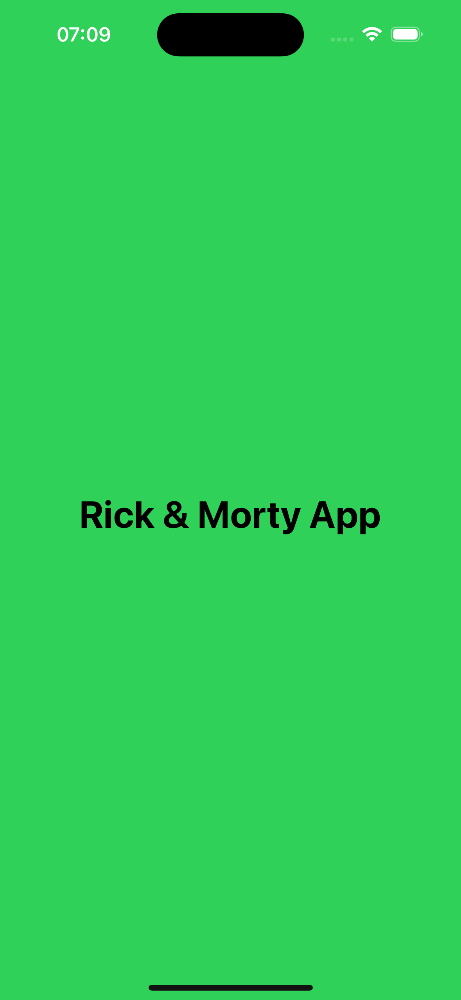
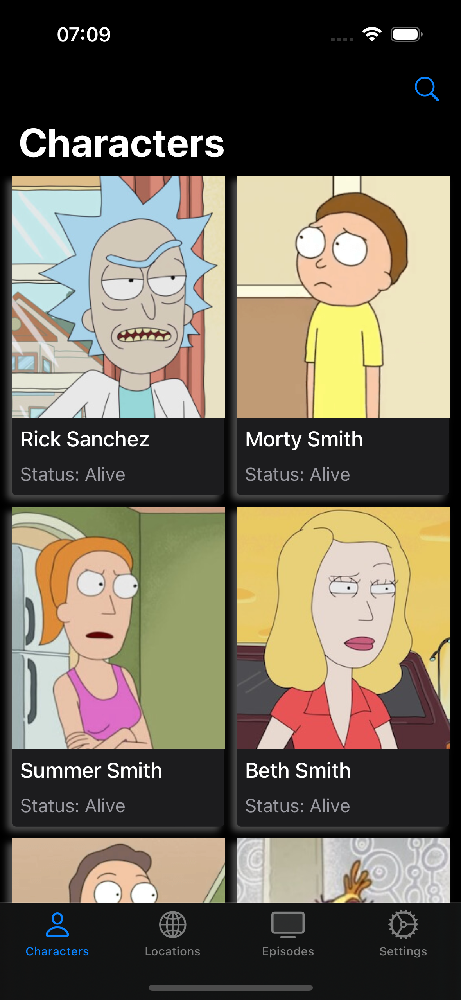
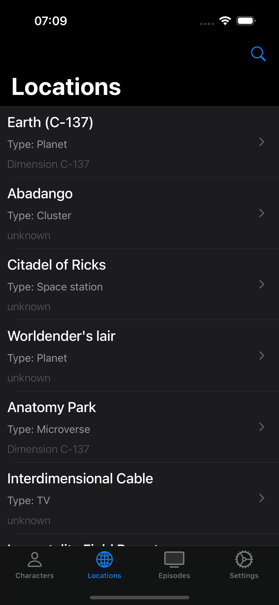
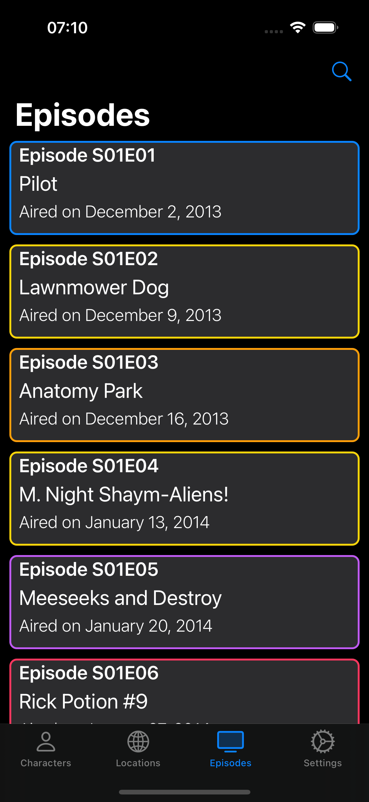
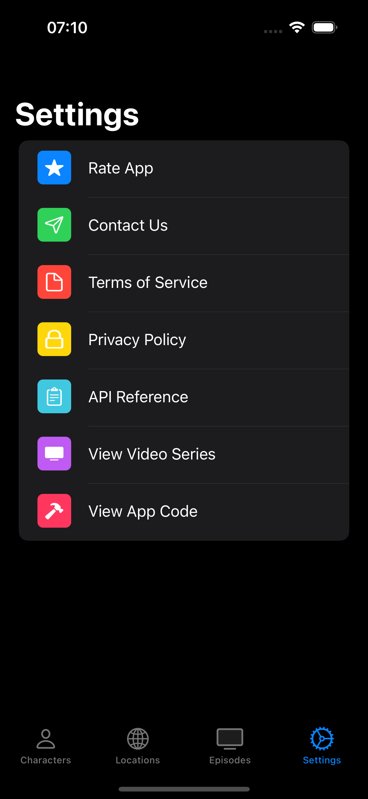
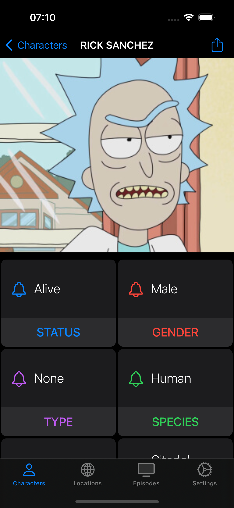
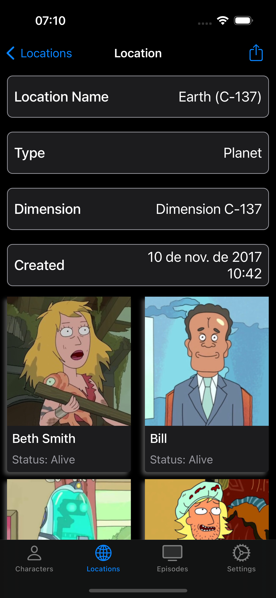
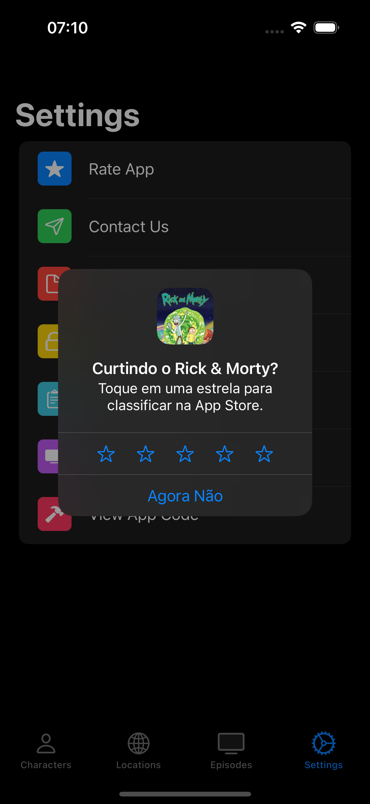

# RickAndMorty
> Aplicativo para desenvolvimento Swift/iOS em ViewCode

Projeto criado utilizando UIKit e SwiftUI no mesmo projeto
Integrado com uma API real do Rick and Morty
Utilizado arquitetura MVVM

## Snapshots

  
 

 
  

  
 

 
  

 
  

 
  

 
  

 
  